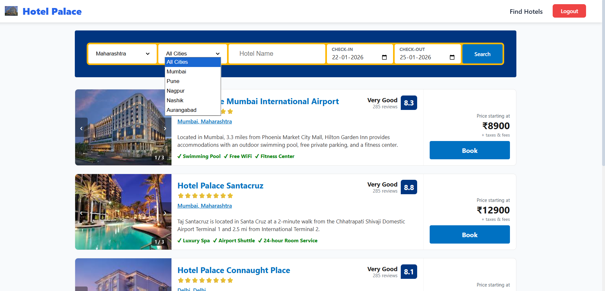
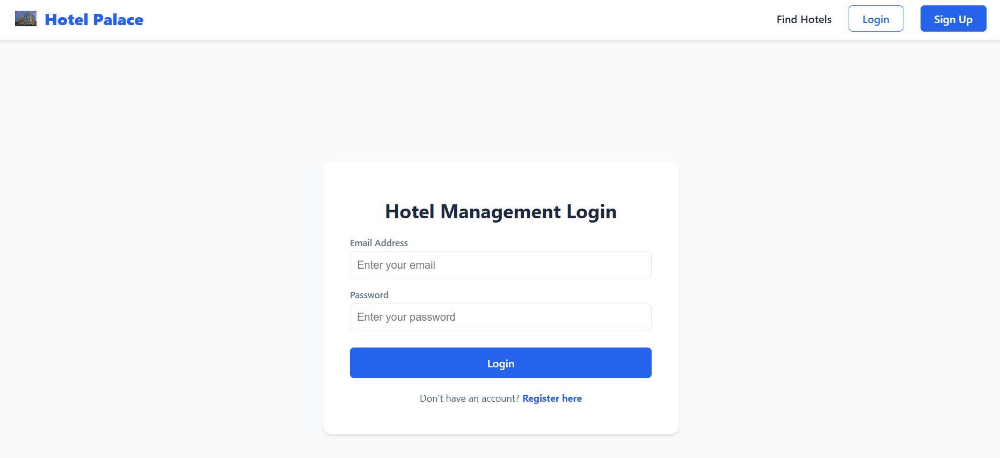
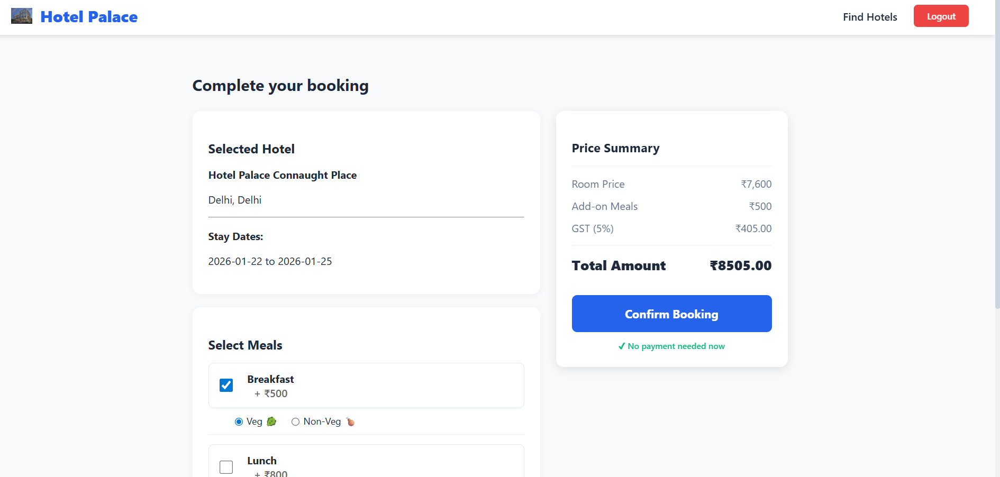
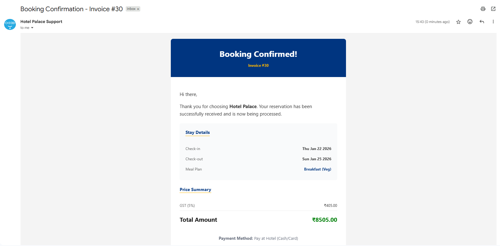
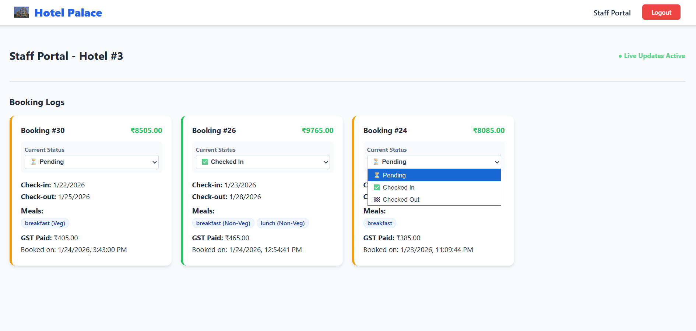
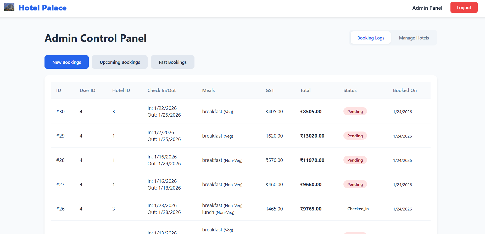
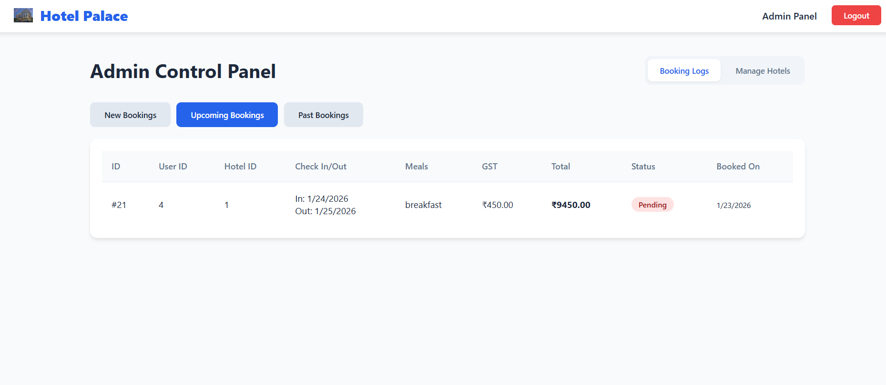
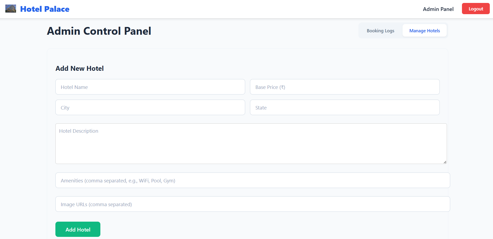
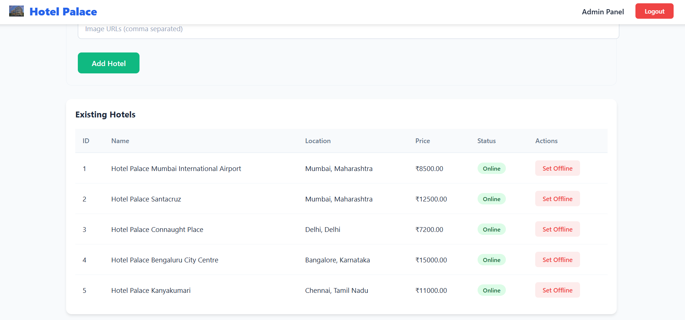

# 🏨 Hotel Management System

A full-stack Hotel Management application built with the **PERN stack (PostgreSQL, Express, React, Node.js)**. It features a complete booking system, role-based access control, and real-time administrative updates.

## 📸 Gallery

| | | |
|:---:|:---:|:---:|
|  |  |  |
|  |  |  |
|  |  |  |

## 🚀 Features

* **Role-Based Access Control (RBAC):** Secure login and registration for **Admins** and **Users**, utilizing **JWT (Access/Refresh tokens)** and **Bcrypt** for password hashing.
* **Advanced Search Algorithm:** Engineered a dynamic search system using **PostgreSQL** to filter hotels by State, City, and Name, enabling real-time filtering of available inventory.
* **Dynamic Pricing Engine:** Implemented complex frontend logic to calculate costs based on date ranges and meal plan selections, ensuring accurate billing.
* **Automated Invoicing:** Integrated **Nodemailer** to automatically generate and send email invoices to users upon successful checkout.
* **Real-Time Staff Notifications:** Integrated **Socket.io** to establish real-time connections, instantly notifying staff of new bookings or status changes.
* **Resilient UI:** Designed a responsive interface using **SCSS** and **React Router**, featuring persistent booking states via **LocalStorage** to prevent data loss on reload.

## 🛠️ Tech Stack

* **Frontend:** React.js, SCSS, Axios, Context API, React Router
* **Backend:** Node.js, Express.js, Socket.io, Nodemailer
* **Database:** PostgreSQL
* **Authentication:** JSON Web Tokens (JWT), Bcrypt
